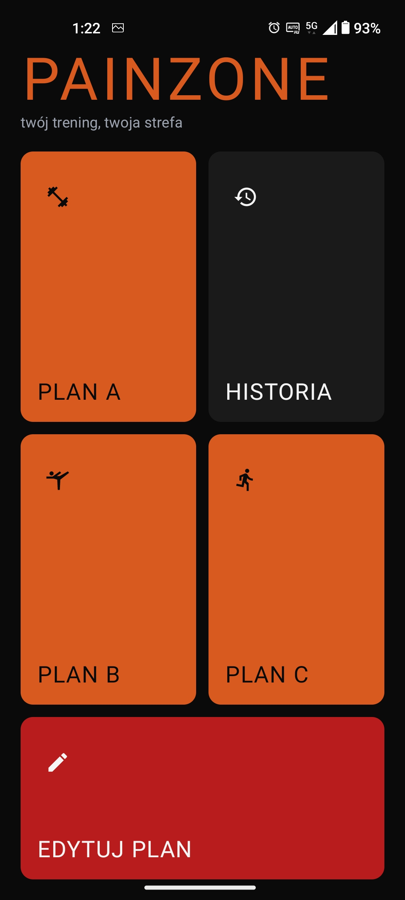
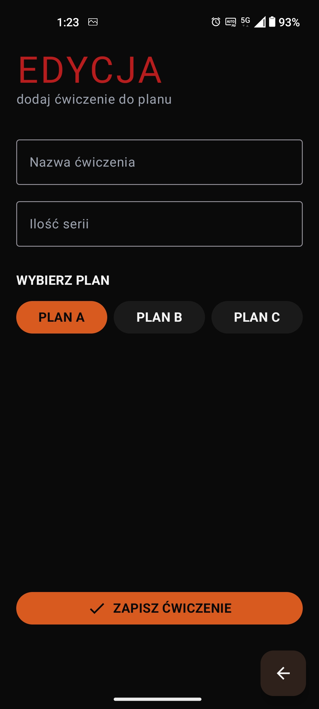
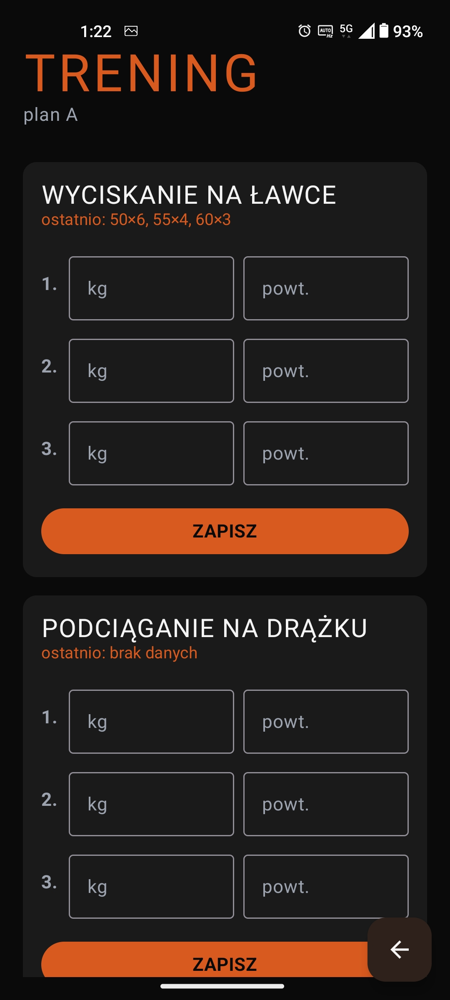

# PainZone

Android app for tracking strength training progress.

## What is this

Watching people at the gym and talking to friends who lift, I noticed that most of them just do a few sets of a few exercises and try to lift more than last time. Meanwhile, popular training apps have so many features that simply logging your weights and reps takes too long.

PainZone is meant to be fast and clear — you open it, enter your results, see what you did last time, and move on.

All code in this repository was written by me, from scratch. Every line is mine and I understand what it does and why. I documented my learning process and design decisions in a dev log (`docs/PodsumowaniePracy.md`).

## App preview

## Features

- 3 independent training plans (A, B, C), up to 10 exercises each
- Quick entry of weights and reps during a workout
- Last results shown next to each exercise
- Workout history split by plan
- Deleting exercises from plan and from history (long press)
- Input validation (max 20 sets, max 999 reps/weight)
- Data stored locally — survives app restarts

## Tech

Kotlin,
Jetpack Compose,
MVVM architecture,
Data stored in Room (SQLite),
Navigation Compose with argument passing between screens,
Unit tests.

## How to run

Easiest option — [download the APK from Releases](https://github.com/KrzysiekPorwol/PainZone/releases/latest) and install on an Android phone.

If you want to look at the code — clone the repo, open in Android Studio and run on an emulator or phone.

## What's next

PainZone is the first version of this project — written from scratch to properly learn Kotlin, Compose and Android architecture.

Next step is PainZone v2 in a separate repository. This time I plan to work with Claude Code as a support tool — I still want to understand and control what happens in the project, but speed up the actual coding.

---

# PainZone (PL)

Aplikacja na Androida do zapisywania postępów w treningu siłowym.

## O co chodzi

Obserwując ludzi na siłowni i rozmawiając ze znajomymi którzy trenują, zauważyłem że zdecydowana większość robi po prostu parę serii przy paru ćwiczeniach i stara się podnieść więcej niż poprzednio. Tymczasem topowe aplikacje tego typu mają tyle funkcji, że zwykłe zapisanie ciężaru i powtórzeń zajmuje za dużo czasu.

PainZone ma być szybki i przejrzysty — wchodzisz, wpisujesz wyniki, widzisz co robiłeś ostatnio, idziesz dalej.

Cały kod w tym repozytorium napisałem samodzielnie. Każda linijka jest moja i rozumiem co robi i dlaczego tak jest. Proces nauki i decyzje projektowe dokumentowałem na bieżąco w dzienniku pracy (`docs/PodsumowaniePracy.md`).

## Prezentacja aplikacji

## Co robi aplikacja

- 3 niezależne plany treningowe (A, B, C), w każdym do 10 ćwiczeń
- Szybkie wprowadzanie ciężarów i powtórzeń w trakcie treningu
- Podgląd ostatnich wyników przy każdym ćwiczeniu
- Historia treningów z podziałem na plany
- Usuwanie ćwiczeń z planu i z historii (przytrzymanie)
- Walidacja danych (max 20 serii, max 999 powtórzeń/ciężaru)
- Dane zapisywane lokalnie — przeżywają zamknięcie aplikacji

## Technologie

Kotlin, 
Jetpack Compose, 
Architektura MVVM, 
Dane trzymane w Room (SQLite),
Nawigacja przez Navigation Compose z przekazywaniem argumentów między ekranami,
Unit testy.

## Uruchomienie

Najprostsza opcja — [pobierz APK z zakładki Releases](https://github.com/KrzysiekPorwol/PainZone/releases/latest) i zainstaluj na telefonie z Androidem.

Jeśli chcesz przejrzeć kod — sklonuj repo, otwórz w Android Studio i odpal na emulatorze lub telefonie.

## Co dalej

PainZone to pierwsza wersja tego projektu — pisana od zera, żeby dobrze zrozumieć Kotlina, Compose i całą architekturę Androida.

Następny krok to PainZone v2 w osobnym repozytorium. Tym razem planuję pracować z Claude Code jako narzędziem wspomagającym — dalej chcę rozumieć i kontrolować to co się dzieje w projekcie, ale przyspieszyć samą pracę z kodem.
